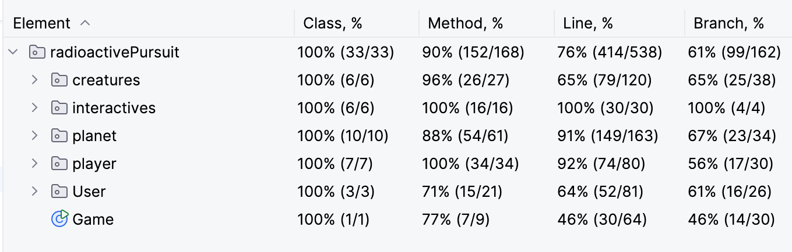

# Radioactive-Pursuit

### Welcome to RadioActive Pursuit!
You are a scientist who travelled to space before Earth went through an apocolptic event that wiped out humanity here. 

Now as you approach Earth once more, humanity gone, it is your mission to restore it. 

Explore different biomes and cure or kill creatures until you have beat the game, or until it beats you...

# Submission Materials
**Team members:** Jacey Fischer && Elizabeth Coleman
**Design Patterns:** Below is a diagram (not formal UML) that represents our code structure and highlights specific design patterns with red circles. 

We used 5 patterns: 
1. Strategy - for the user to choose the player's strategy for each turn
2. Builder - used to set up an instance of Planet
3. Factory - occurs for Creature, Artifacts, and Biome
4. Singleton - implemented for the leaderboard (because you want that to hold all users)
5. Facade - display acts as a facade for the game

**Test Coverage:** 

**Expansion of Game**
Now that we have a starting point for this, there is room that was intentionally left for this to be built upon as a project. 

It has been designed to set up more complicated game play, games with more creatures, more variety, more biomes, and more interactive objects throughout the maze (which means more player options as well). We also hope to expand into a more thorough game UI. 

